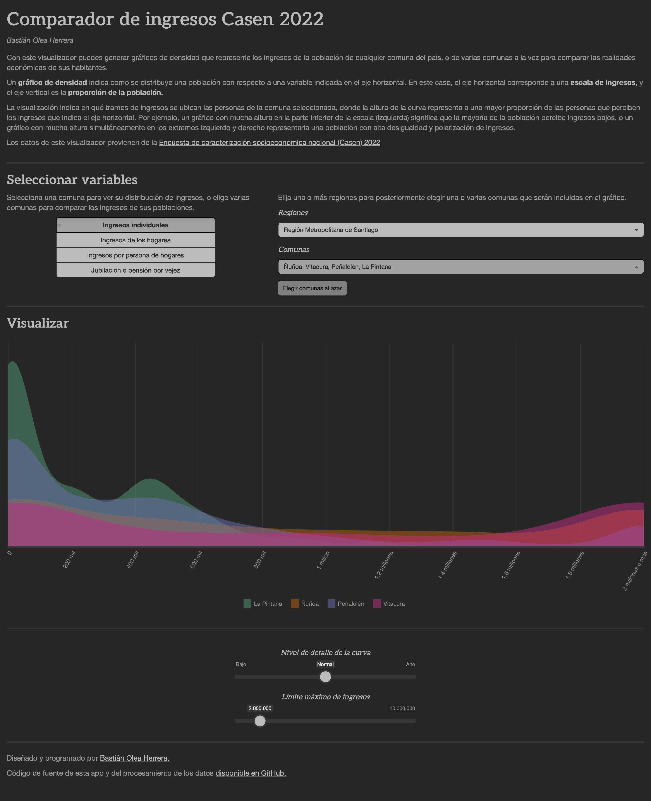

# Comparador de ingresos comunales CASEN 2022

[Aplicación web](https://bastianoleah.shinyapps.io/casen_comparador_ingresos) para generar gráficos de densidad que representan los ingresos de la población de cualquier comuna del país, o de varias comunas a la vez, para poder comparar las realidades económicas de sus habitantes.

Un gráfico de densidad indica cómo se distribuye una población con respecto a una variable indicada en el eje horizontal. En este caso, el eje horizontal corresponde a una escala de ingresos, y el eje vertical es la proporción de la población.

La visualización indica en qué tramos de ingresos se ubican las personas de la comuna seleccionada, donde la altura de la curva representa a una mayor proporción de las personas que perciben los ingresos que indica el eje horizontal. Por ejemplo, un gráfico con mucha altura en la parte inferior de la escala (izquierda) significa que la mayoría de la población percibe ingresos bajos, o un gráfico con mucha altura simultáneamente en los extremos izquierdo y derecho representaría una población con alta desigualdad y polarización de ingresos.

## Datos
Los datos provienen de la [Encuesta de caracterización socioeconómica nacional (Casen) 2022](https://observatorio.ministeriodesarrollosocial.gob.cl/encuesta-casen-2022).

Puedes descargar la base de la Casen 2022 por comunas con variables de ingreso en formato `.parquet` [en este enlace](https://github.com/bastianolea/casen_comparador_ingresos/raw/main/datos/casen_ingresos.parquet), y para poder usarla debes aplicar diseño de encuestas complejas con `{survey}` o `{srvyr}` [como se explica en este post.](https://bastianolea.rbind.io/blog/casen_introduccion/)

## Aplicación
[La aplicación web está disponible en shinyapps.io](https://bastianoleah.shinyapps.io/casen_comparador_ingresos), o bien, puedes clonar este repositorio en tu equipo para usarla por medio de RStudio.

## Procesamiento 
1. casen2022_importar.R
2. casen2022_procesar.R
3. casen2022_preparar.R

----

Diseñado y programado en R por Bastián Olea Herrera. Magíster en Sociología, data scientist.

https://bastian.olea.biz

bastianolea arroba gmail punto com